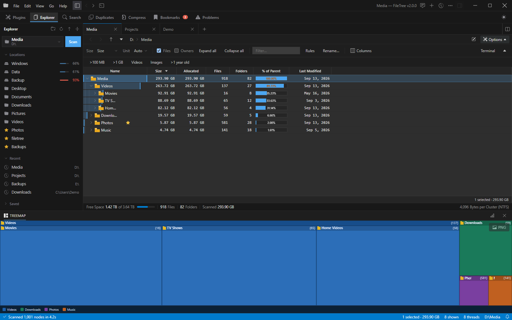
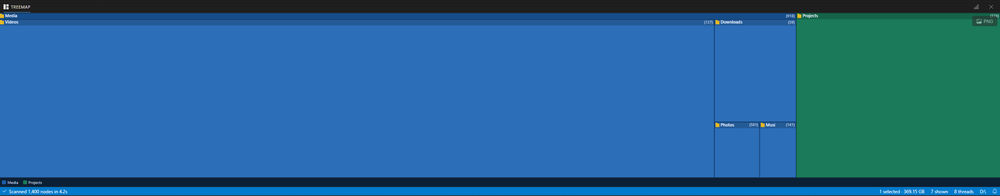
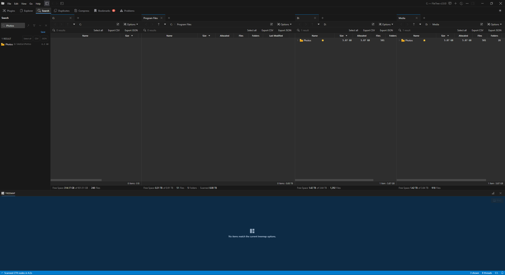
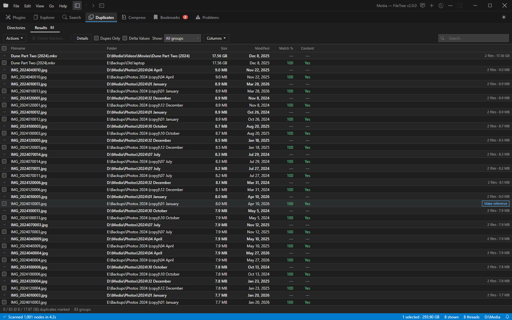
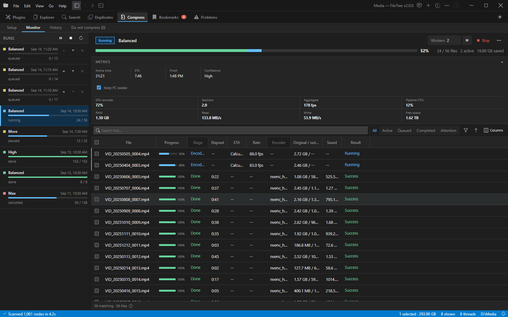

# FileTree

**See what's filling your disks, then deal with it — fast.** FileTree is a low-memory Windows disk-usage explorer with a tree and treemap view, a content-verified duplicate finder, and GPU video/image compression.



**Current version:** `2.0.0` (performance release in pre-release validation). The v2 desktop uses Tauri 2 with one WebView2 control; Electron is no longer bundled.

> Screenshots come from the [demo build](#demo-build)

## Highlights

- **Explore disk usage** — multi-threaded scans into per-scan SQLite indexes, a virtualized tree table, treemap and 3D treemap, split panes and tabs, live refresh as files change.
- **Find duplicates** — multi-root scans verified by content, not just name or size, with batch delete/move/copy and a persistent hash cache.
- **Compress media** — hardware-only (NVENC / Quick Sync / AMD) video and image compression with a live monitor, resumable queue, verified outputs and preserved file dates.
- **Built for huge folders** — paged SQLite queries, bounded renderer memory and lazy loading keep 10M+ item scans responsive.

## Explore disk usage

Scan a drive or folder and FileTree shows every folder's size, allocated space, file and folder counts, share of its parent and dates, sorted however you like. The treemap below the table shows the same space at a glance: every folder is a tile sized by what it holds, labeled with its item count.



- Each pane's **Options** button (right end of the address bar) shows or hides its view options: size metric, units, files, filters, columns and quick filters such as *>1 GB* or *Videos*.
- Native Windows context menus, drag-and-drop, rename, move, copy, Recycle Bin delete and undo, with risk-scoped confirmations.

## Split panes and search



- Open folders in tabs and split the editor into side-by-side panes; drag tabs between panes, and **middle-click** a folder to open it in a background tab.
- The **Search** sidebar filters every open pane at once and lists all matches with their full path and size, ready to select or export to CSV/JSON.
- Search is case-insensitive and tokenized (`-term` excludes, `name:`, `path:`, `ext:`, `type:`, wildcards, optional regex) and runs against the scan index, not the renderer.

## Find duplicates



Pick folders or whole drives, choose what counts as a match — content, size, name and date, each optional or required, with fuzzy names and date tolerance — and scan. Results show a match score per file; delete, move, copy, make-reference or export to CSV in bulk. Repeated scans skip unchanged files thanks to the content-hash cache.

## Compress videos and images



Shrink large media in place or into a separate folder:

- Hardware video encoding through HandBrake (NVENC, Quick Sync or AMD, with hardware decoding where supported). Video never falls back to a software encoder; a hardware failure leaves the source untouched.
- Every output is verified before the original is recycled, deleted or kept, and compressed files keep the original's **creation and modified dates**, so a replacement never looks like a new file.
- The **Monitor** shows size-weighted progress, per-file stage, speed and ETA, GPU/CPU/disk telemetry and a diagnostics inspector. Pause or resume one run, or use **Pause all** / **Stop all** for every run at once; queued runs survive restarts.
- **History** keeps a searchable, exportable log with commands and encoder output. Files that didn't shrink are remembered and skipped next time.

<details>
<summary><strong>Full feature list</strong></summary>

### Disk scanning and navigation

- Multi-threaded recursive scanner with live progress, cancellation, refresh, and per-scan SQLite indexes under `%LOCALAPPDATA%\FileTree\v2\scans`.
- Real-time filesystem watching with incremental directory patching, so created, moved, renamed, and deleted items appear without a full rescan.
- Multi-tab workspace with split editor panes, draggable tabs, a shared Explorer sidebar, and persisted pane layout.
- Drive, common-folder, Recycle Bin, recent-path, and bookmark navigation; back/forward/up, breadcrumbs, a Recent locations menu and double-click drill-in.
- Hidden-file, symlink-follow, owner-collection, thread-count, and exclude-pattern scan options.
- Reparse-point/junction handling to avoid double-counting and noisy access-denied errors.

### Tables, search, and analysis

- Virtualized details table with sortable/resizable columns, multi-select, and configurable visible columns.
- Size, allocated size, counts, percent of parent, full path, folder path, type, attributes, dates, average file size, path length, directory level, and compression columns.
- Automatic or fixed units, decimal-place control, and persistent table preferences.
- Size, date, extension, category, and regex filters run against the paginated SQLite scan.
- Treemap panel plus an interactive 3D treemap.
- Side panels for Details, Extensions, Age Distribution, Top Files, Duplicates, Errors, Bookmarks, and AI Chat.
- Hover cards, image/video thumbnails, cached Windows Shell thumbnails, and representative folder thumbnails.

### File operations

- Open, reveal in Explorer, copy path/name, properties, rename, create folder, move, copy, paste, recycle, and permanent delete.
- Native Windows shell context menus for files and folders.
- Risk-scoped confirmations for large, many-item, cross-drive, or permanent operations.
- Undo for reversible moves and Recycle Bin deletes.
- Native drag-and-drop for files, folders, and mixed selections, including moves across panes, drops onto folder rows or treemap tiles, and drag-out to Explorer.

### Duplicate finder

- Multi-root scans with content verification and a persistent content-hash cache.
- Composable Content, Size, Name, and Date criteria with required-rule toggles, fuzzy-name thresholds, and date tolerance.
- Path, extension, and size filters before hashing.
- Match %, per-criterion deltas, dupes-only and delta toggles, in-table search, and a Columns menu.
- Batch delete, move, copy, make-reference, reveal, ignore, and CSV export.

### Compression workspace

- Setup, Monitor, and History workspaces for mixed video, image, and archive batches.
- Hardware-only HandBrake encoding, audio passthrough, codec/quality presets, and at most two parallel workers.
- Graceful pause/resume, Pause all / Stop all, immediate resumable stop, pending-file prioritize/skip, selective retry, and persisted queued batches.
- Deep output verification, partial-output cleanup on stop, low-space/stall warnings, and source-preserving failures.
- Durable no-gain fingerprints; changed sources, presets, codecs, encoders, or tools trigger a fresh attempt.
- In-place or separate-folder output, Recycle Bin by default with optional delete or keep modes, and `[COMPRESSED]` tagging.
- Original creation and modified dates carried onto compressed files.
- Windows keep-awake and taskbar progress while compression is active.

### AI assistant

- Multi-agent assistant with an Orchestrator, read-only Search agent, and approval-gated Action agent.
- Local Ollama support plus OpenAI and Anthropic models with machine-local API keys.
- Persistent chats, Markdown replies, image and folder attachments, approval workflow for mutating work, and MCP tool discovery.

### Integrated terminal

- Windows terminal opened at the selected folder or scan root, with terminal-style copy and paste.

### Export, CLI, and packaging

- CSV or JSON export for scan and duplicate results; headless CLI scans with JSON or CSV output.
- Tauri 2 shell with one WebView2 control, typed commands, and bounded progress channels; no localhost desktop server.
- `filetree-core`, `filetree-cli`, and `filetree-desktop` crates in one Cargo workspace.
- Portable app and NSIS installer; end users do not need Node.js or Rust.

### Performance

- Link-time optimized release builds for hot scan, hash, and JSON paths.
- Scanner output crosses an 8,192-row bounded channel into 10,000-row SQLite transactions; tree/search pages are capped at 500 rows and compression pages at 250.
- The renderer retains at most sixteen tree pages (8,000 rows / 16 MiB), with 16 MiB thumbnail and 4 MiB icon budgets; inactive tabs release rows, watchers, and caches.
- Scan indexes are capped at 10 GiB with least-recently-used eviction.

</details>

## Build

Prerequisites: Rust stable (1.85+), Node.js 18+.

Build the portable app from the repo root:

```powershell
.\build-portable.bat
```

This builds the frontend, the Tauri desktop app and NSIS installer, and the standalone CLI, assembles `dist-portable\FileTree\`, and starts it. Add `-NoLaunch` to skip starting it:

```powershell
.\build-portable.bat -NoLaunch
```

`FileTree.exe` uses the WebView2 runtime included with current Windows 10/11. `filetree-cli.exe` provides headless scan and opt-in `serve` workflows.

Manual build:

```powershell
# Build the frontend (output goes to frontend/dist/, embedded at compile time)
cd frontend
npm install
npm run build
cd ..

# Build the CLI and Tauri desktop
cargo build --release -p filetree-cli
npm run build
```

The desktop executable is at `.\target\release\FileTree.exe`; the CLI is at `.\target\release\filetree-cli.exe`.

### Demo build

`build-demo.bat` builds **FileTree Demo** (`dist-demo\FileTree Demo\`), which fills every page with invented drives, files, duplicates and compression runs — handy for screenshots and trying the UI. It has its own app identity and data folder and never reads or changes anything on the PC. To see the same data in a browser:

```powershell
npm --prefix frontend run demo
```

## Run

Double-click the exe, or from a terminal:

```powershell
.\target\release\FileTree.exe
```

CLI modes:

```powershell
# Headless scan — write JSON or CSV report
.\target\release\filetree-cli.exe scan D:\Data --format json --out scan.json
.\target\release\filetree-cli.exe scan D:\Data --format csv --out scan.csv

# Serve the web UI only (no native window)
.\target\release\filetree-cli.exe serve --port 7878
```

## Development

```powershell
cargo fmt --check
cargo clippy --all-targets -- -D warnings
cargo test
npm --prefix frontend test
```

Frontend hot-reload during development:

```powershell
cd frontend && npm run dev
```

Then open the URL printed by Vite (the Rust server must also be running on port 7878).

## License

FileTree is licensed under the PolyForm Noncommercial License 1.0.0. See [LICENSE](LICENSE).

## Notes

Not affiliated with JAM Software or TreeSize. Independent Rust implementation.
